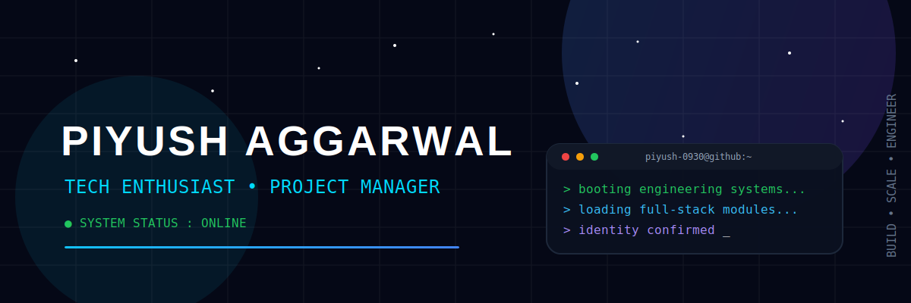
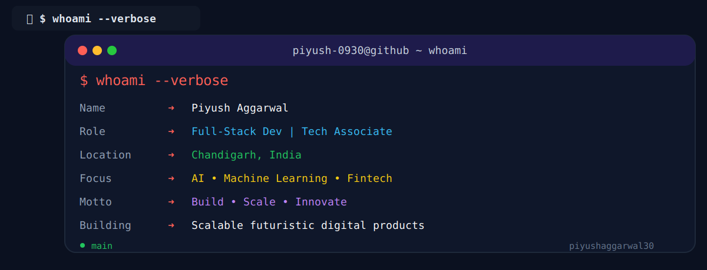
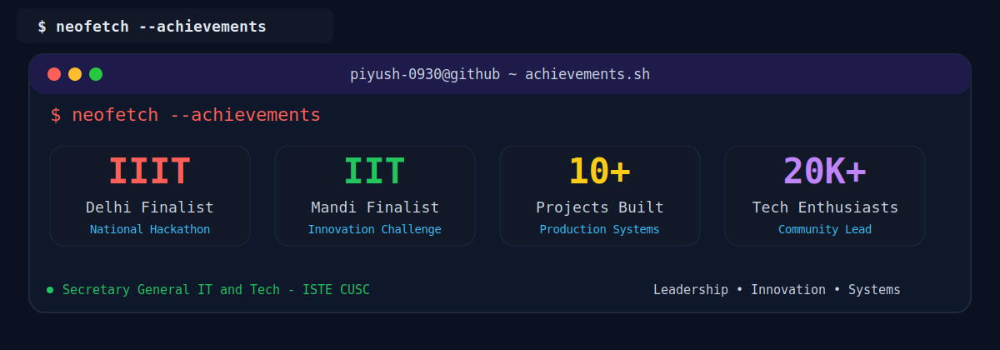
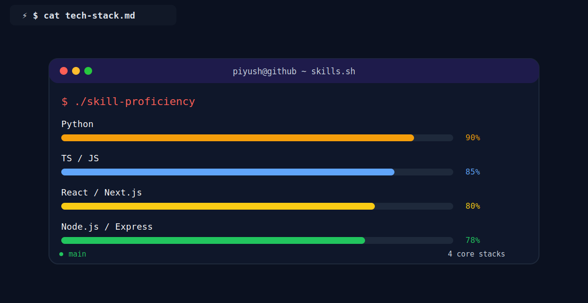
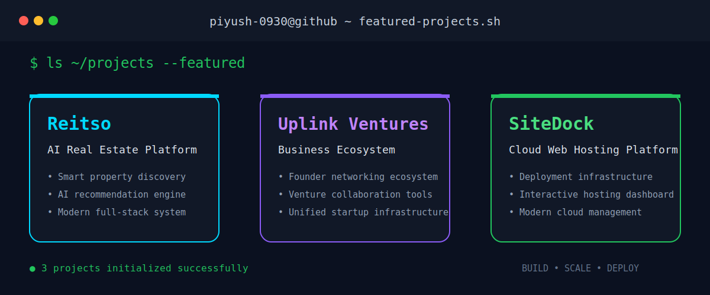
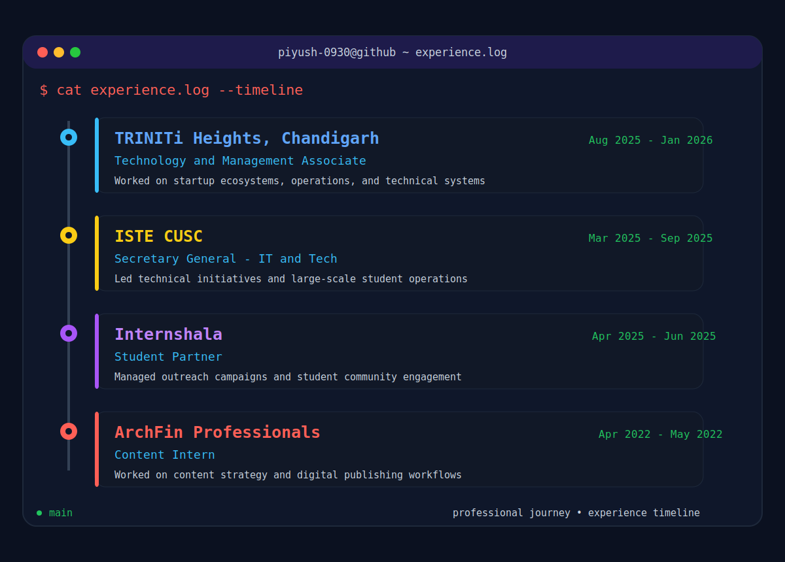

 

  

  
  
  

---

---

---

  

 

<b>📋 Detailed Skill Breakdown</b> (click to expand)

 

| Category | Technologies |
|----------|---------------|
| **Languages** | Python • JavaScript • TypeScript • Java |
| **Frontend** | React • Next.js • Tailwind CSS • HTML5 |
| **Backend** | Node.js • Express.js • Django |
| **Databases** | MongoDB • MySQL • Firebase |
| **Cloud & DevOps** | AWS • Docker • Git • GitHub |
| **AI / ML** | AI/ML • HuggingFace • Ollama |
| **Management** | Program Management • Operations • Community |

---
 

 

  

---

  

&nbsp;&nbsp;&nbsp;&nbsp;
&nbsp;&nbsp;&nbsp;&nbsp;
&nbsp;&nbsp;&nbsp;&nbsp;
&nbsp;&nbsp;&nbsp;&nbsp;

---

  

  

---

  

 

